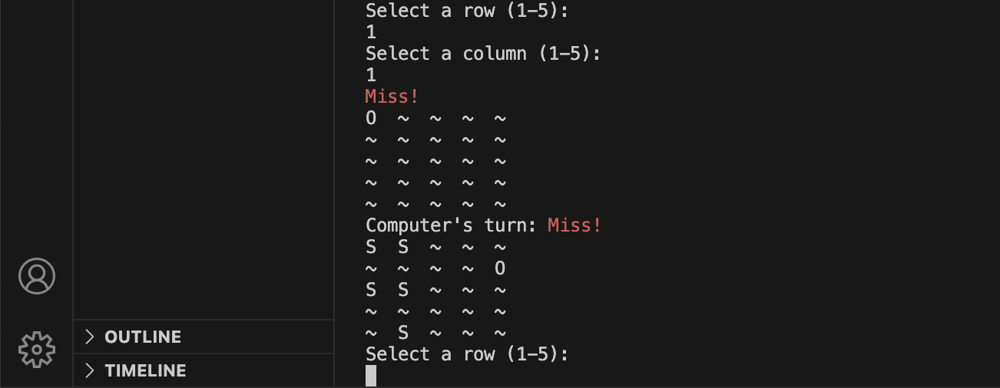
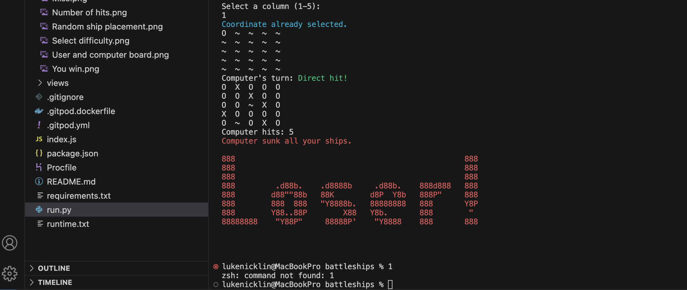

## Creating the Heroku app - EDIT

When you create the app, you will need to add two buildpacks from the _Settings_ tab. The ordering is as follows:

1. `heroku/python`
2. `heroku/nodejs`

You must then create a _Config Var_ called `PORT`. Set this to `8000`

If you have credentials, such as in the Love Sandwiches project, you must create another _Config Var_ called `CREDS` and paste the JSON into the value field.

Connect your GitHub repository and deploy as normal.

# Battleships

Battleships is an interactive game that allows users to select a difficulty level between 'easy' and 'hard' and then select coordinates in the form of rows and columns to sink the computer's ships. The game shows the user's boards with the placement of their ships and the computer's board where the ships are hidden. It notifies the user of a hit with an 'X' and a miss with an 'O'. The winner is determined when they sink all their opponent's ships first.


## Features 

The Battleships game includes the following features:

- User can select the difficulty of the game. 'Easy' creates a 5x5 board. 'Hard' creates a 9x9 board.
- Shows the user board and computer board.
- Radnom ship placement.
- Marking the board with 'X' for a hit and 'O' for a miss.
- Number of hits the user and computer has made.
- A win or lose message depending on the outcome of the game.

### Existing Features

__Select difficulty__

  - When starting the game, the user is asked to select the difficulty between 'Easy' and 'Hard.
  - If they enter 'Easy', they will play using a 5x5 board.
  - If they enter 'Hard', they will play using a 9x9 board.


__User and computer boards__

  - Once the user enters the difficulty, a board is created for the user and for the computer.


__Random ship placement__

  - When the boards are created, the ships are randomly placed on both boards. The ships are visible on the user's board but hidden on the computer's board.
   


__Hits and misses__

  - To keep track of hits and misses, the game marks a hit with an 'X' and a miss with a 'O'. This is so the user can see what they've hit, what they've missed and coordinates they haven't selected yet. 




__Number of hits__ 

  - Each time the user or computer has a hit, the game shows the number of hits the user has made and the number of hits the computer has made. This allows the user to easily see who's winning and how many ships are left.


__Win or lose message__ 

  - If the user sinks all the computer's ships first, they will see a 'You win' message. If the computer sinks all the user's ships first, the user will see a 'Loser!' message.




### Features to implement in the future

- A version that allows the user to select where they want to place their ships
- The ability to include larger ships that span multiple coordinates

## Data Model

## Technologies

* Python
    * The entrie game was created using python.
    * Used to generate different sized boards based off of difficulty selected by the user.
    * Used to place ships randomly on each board.
    * Used to ask the user to select a row and a column to select a coordinate to fire at.
    * Used to display hits ('X') and misses ('O').
    * Used to display the number of user and computer hits.
    * Used to determine the winner when either the user or the computer has sunk all their opponent's ships. 
* Visual Studio Code
    * The game was developed using the Visual Studio Code text editor.
* GitHub
    * Source code is hosted on GitHub and delpoyed using Git Pages.
* Git 
    * Used to commit and push code during the development opf the Website 

## Testing

### Functional Testing

**Difficulty**

Testing was performed to ensure the difficulty input produced the correct size board. This was done by entering 'Easy' and 'Hard' at the beginning of the game.

Both inputs produced the expected behaviour.

Steps to test

1. Navigate to the Battleships game.
2. Enter 'Easy' (for a 5x5 board).
3. Enter 'Hard' (for a 9x9 board).

Expected behaviour:

When the user enters 'Easy', the board created was 5x5. When the user enters 'Hard', the board created was 9x9.

Actual:

Behaviour as expected

**Choosing coordinates**

Testing was performed to ensure the right coordinates were chosen when a user entered a row and a column.

The row and column inputs behaved as expected and matched the correct coordinates on the board.

Steps to test

1. Navigate to the Battleships game.
2. Enter 'Easy' (for a 5x5 board) or 'Hard' (for a 9x9 board).
3. Enter a row number and a column number.
4. Check the board to see that the correct coordinate was selected on the computer's board.

Expected behaviour:

When the user selects a row and a column, the correct coordinate is chosen on the computer's board.

Actual:

Behaviour as expected

**Hits and missess**

Testing was performed to ensure that a 'X' was marked on the board for a hit and an 'O' was marked on the board for a miss.

The board behaved as expected and showed an 'X' for a hit and a 'O' for a miss.

Steps to test

1. Navigate to the Battleships game.
2. Enter 'Easy' (for a 5x5 board) or 'Hard' (for a 9x9 board).
3. Enter a row number and a column number.
4. Check the board to see if the coordinate chosen is marked with an 'X' for a hit or an 'O' for a miss.

Expected behaviour:

When the user hits a computer ship, an 'X' is marked on the board. When the user misses a computer ship, an 'O' is marked on the board.

Actual:

Behaviour as expected

**User and computer hits**

Testing was performed to ensure that when a user or a computer has a hit, the game shows how many hits the user has had and how many hits the computer has had.

The board behaved as expected and showed how many user and computer hits when either has a hit.

Steps to test

1. Navigate to the Battleships game.
2. Enter 'Easy' (for a 5x5 board) or 'Hard' (for a 9x9 board).
3. Enter a row number and a column number.
4. Check the board to see if the coordinate chosen is marked with an 'X' for a hit or an 'O' for a miss.
5. Check to see if the game shows how many user and computer hits when either has a hit.

Expected behaviour:

When the user or computer had a hit, the game shows the number of user hits and number of computer hits.

Actual:

Behaviour as expected

**Win or lose**

Testing was performed to ensure that when a the game is finished, the user either sees a 'You win' message or a 'Loser!' message depending on the outcome of the game.

The board behaved as expected and showed the user a 'You win' message when they won.
The board behaved as expected and showed the user s 'Loser!' message when they lost.

Steps to test

1. Navigate to the Battleships game.
2. Enter 'Easy' (for a 5x5 board) or 'Hard' (for a 9x9 board).
3. Enter a row number and a column number.
4. Keep playing until you win to see the 'You win' message or lose to see the 'Loser!' message.

Expected behaviour:

When the user won the game, they saw a 'You win' message.
When the user lost the game, they saw a 'Loser!' message.

Actual:

Behaviour as expected

**Error messages**

Error messages have been used throughout the battleships game to inform the user when they have made a mistake and how to correct it. Error messages are used for the following:

- When selecting a difficulty level


- When entering coordinates


- When a user selects a coordinate they've already selected


### Validator Testing

- Python
  - No errors were returned when passing the Battleships game through the [CI Python Lintor](media/CI%20Python%20Linter.png)
 
### Bugs

There are no known bugs within the code.

## Deployment - EDIT

- The site was deployed to...

### Version Control

The site was created using the Visual Studio Code editor and pushed to github to the remote repository 'battleships'.

The following git commands were used throughout development to push code to the remote repo:

```git add <file>``` - This command was used to add the file(s) to the staging area before they are committed.

```git commit -m "commit message"``` - This command was used to commit changes to the local repository queue ready for the final step.

```git push``` - This command was used to push all committed code to the remote repository on github.

### Clone the Repository Code Locally

Navigate to the GitHub Repository you want to clone to use locally:

- Click on the code drop down button
- Click on HTTPS
- Copy the repository link to the clipboard
- Open your IDE of choice (git must be installed for the next steps)
- Type git clone copied-git-url into the IDE terminal

The project will now have been cloned on your local machine for use.


## Credits 

### Code

- CodeInstitute - Python module helped me gain a good understanding of the fundamentals such as variables, operators, functions and classes. These concepts allowed me to build the foundation of the Battleships game. 
- StackOverflow - Helped me to troubleshoot issues I was having with Python throughout the project.
- [Knowledge Mavens - How to Code Battleship in Python - Single Player Game](https://www.youtube.com/watch?v=tF1WRCrd_HQ) was used to help me better understand different ways to use Python to make the game work.
- Zed Shaw's 'Learn Python 3 the Hard Way' book helped me to practice working with Python code, providing multiple exercises to work through.